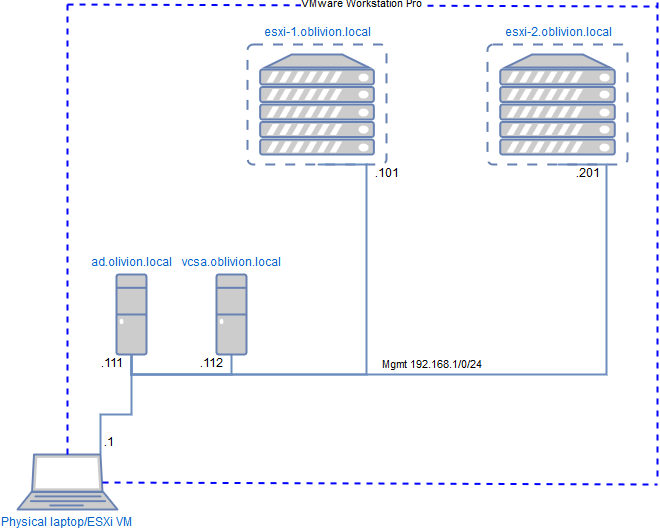

# Introduction

This document will run through the installation of a lab environment using
VMWare's vSphere software suite installed on top of VMWare Workstation. This
lab was implemented during Special Subject 2 at EAL Odense. The lab is based on
the configuratiopn desribed by Keith Barker in the [CBT Nugget](https://www.cbtnuggets.com) series "VMware vSphere 6".

We have followed the vSphere 6.0 series as the rest of the class, but installed
using vSphere 6.5, as our group was tasked with presenting the differences.

*A domain named `oblivion.local` is used throughout this document but you are
advised to change this to something that suits your installation*

## Requirements and dependencies

  * Audience skills
    - Knowledge of virtualisation technologies.
    - Experience using VMWare Workstation
    - Experience installing both Windows and Unix-like operating systems
    - Able to install operating system and partition drives in the process.

  * Hardware
    - Hardware virtualisation
    - 16Gib+ system memory

  * Software
    - VMWare Workstation
    - VMware vSphere software suite
    - Windows 2012 R2 server

## Certificates

All VMware products in this document by default uses self signed certificates,
the browser will warn you about this, and you will have to accept it to complete
the installation.

## Lab machines

The "Physical machine" mentioned throughout the Rescue Documentation is anything
that has enough memory and runs VMWare Workstation with nested virtualisation
working.

* **Physical machine**: Runs the lab in WMware Workstation. Connected to the
  Management network (192.168.1.0/24). NATting is used and an interface exposed
  to the host OS, to sidestep IP issues when changing beeween
  home/school/tethered network.

* **ad.oblivion.local**: Windows 2012 R2 server doing DHCP and DNS for the
  Management network.

* **vcsa.oblivion.local**: The vCenter Server Appliance control machine,
  deployed outside and ESXi.

* **esxi-[12].oblivion.local**: The ESXi installations.

During our work these configurations for the "Physical Machine" was used:

* A laptop with 16Gb of RAM using VMWare Workstation running on Windows 10.
* A server running ESXi, with a Debian VM using VMWare Workstation.

The physical machine is configured to use the DNS server at ad.oblivion.local to
be able to do name resolution for the VM in WMWare Workstation and the ESXis.

## Network

*Layer 3 network diagram for the vSphere lab*

*The complete network of the CBT Nuggets were configured as shown elow, the
above network diagram shows what was tested and working, the management
network.*

The configuration in VMware Workstation is hown below.

*VMware Workstation network configuration*

The details shown are for the NATted management network, in the picture DHCP is
enabled. This is not needed and was used initalially for testing. The rest of
the networks also uses no DHCP but is connected to a virtual adapter in the host.

# Installation

A general note about virtual drive configurations in the VMs both in Workstation
and ESXi. Do not be alarmed when asked, in the following, to allocate more space
than you have physically available.

The reason this is possible is that "thin provisioning" is used for all drives,
meaning (roughly spealking) that only the space currently used by the files on
the drive is allocated on the physical system.

There is going to be quite a few passwords to keep track of, saving these
somewhere safe and secure, might help.

## Installing the ESXI virtual machines.

First create a virtual machine in VMWare Workstation with the following
configuration.

*ESXi Virtual Machine configuration*

In the setting shown above only 4Gb of RAM has been alloated for the ESXi
instance, this amount is choosen to prevent the 16Gb laptop from swapping and
slowing down everything.

If you have more memory available you are advised to increase the amount of RAM,
also should you want to deploy the vCenter Server Apliance inside an ESXi,
this ESXi will need 11Gb RAM for the VCSA VM.
In this case the VCSA is installed outside the ESXis so that were the memory is needed.

The actual installation procedure after boot goes:

 1. Select the install option in the bootloader or wait until it is selected by
    default
 2. After loading for a while the installar will ask you to press `Enter` to
    continue the installation, do that.
 3. You propably want to accept the license as well. (Press `F11`)
 4. Select the target disk, there should be only only one, and press `Enter`
    to go on.
 5. Chose keyboard layout.
 6. Enter the password twice (in the installation you can create weaker
    passwords than later accepted)
 7. Confirm the installation by pressing `F11`

Initalially the plan was to clone the first installation, but the second ESXi
install was setup and started while the first was still installing. Installing
the second ESXi you will not have to make sure the MAC addresses have been newly
created, whereas if you clone it make sure to create new MAC addreses for the
network interfaces of the clone.

When the ESXi is installed and rebooted apply static addressing to `vmnic0`
and use it as the management interface.

*`esxi-1` IPv4 configuration*

 1. Enter the console configuration by pressing `F2` and entering the root
    password.
 2. Select `Network Adapters` and select `vmnic0` from the list.
 3. Select `IPv4 Configuration` and configure the static IP address. The
    screenshot above shows the configuration for `esxi-1`.
 4. Select `IPv6 Configuration` and disable IPv6 addressing.
 5. Select `DNS configuration`
   * Set the IP of `ad` (192.168.1.111)
   * Set an alternate DNS for instance googles at 8.8.8.8
   * Set the host name (esxi-1/esxi-2)
 5. Select `Custom DNS suffixes` and set this to your DNS suffix
    (here: oblivion.local)

Repeat these steps and substitute the right values for the second ESXi.

## Setting up Windows 2012 R2 for DNS and AD duties.

The Windows 2012 server is installed as a VM in Workstation along the ESXi
instances. The VM configuration is shown in the image below.

*Windows server VM configuration*

Point the VM at a Windows server 2012 R2 ISO and run through the installation.

*Windows server VM static IP*

Configure every interface with a static IP as shown in the image above. The last
byte of the IPv4 address of the VM is .111 on all connected networks.

### Setting up DNS and DHCP

From the `Server Manager` select `Add roles and features`. When selecting the
roles make sure that you have selected AD, DNS and DHCP related roles as shown
below.

*`ad` VM roles selection*

Next up, create a new forest with the domain you want to use for your lab, as
shown below.

*Create new forest*

The wizard will run some checks on your configuration, and display a summary as
shown below. None of the warnings were critical enough that the installation
will not work.

*Warning in the final check*

All the machines in our lab needs to have their DNS record added

In `Server Manager` select `Tools`, in the drop down `DNS` and the window
`DNS Manager` shown below will appear. Select `Forward Lookup Zones` and right
click selecting `New Zone...` to create a primary DNS zone for the lab domain.

The new zone is shown in the tree view, like `oblivion.local` in the screenshot
below. Expand the new zone and click `Actions` in the menu selecting
`New Host... (A or AAAA))` to create each lab machines DNS entry as shown.

*Add the lab machines DNS records*

To make name resolution work for non local addresses, add Googles DNS server as
forwarder. Select `AD` in the tree view, right click selecting `Properties`. In
the window select `Forwarders`, press `Edit...`. In the new Window enter the IP
of the Google DNS server as shown below.

'
*Add Google DNS as forwarder*

This concludes the AD installation and all machines should be configured to use
the .111 DNS server on their network.

## Deploying the VCSA outside the ESXI's

The vCenter Server Appliance is installed as a VM in an ESXi by default. In This
lab it will be installed in VMWare Workstation side by side with the ESXi's.

It appears that the procedure for deploying VCSA outside the ESXi has become
consideratly more streamlined in 6.5.

 1. Grab `.ova` file located in the VCSA installation CD in the directory  
    `\vcsa\VMware-vCenter-Server-Appliance-6.5.0.*.ova`. This is the VCSA
    the GUI installer deploys inside the ESXi.

 2. Open this file in VMware Workstation to create the VM. Remember to connect
    the network interface of the VM to the managements network. configure
    the network interface to connect to the managment network as shown below.

*Connecting the management network to the VCSA*

 3. Start the machine and wait for the below show management console to appear.
    This is a blue version of the ESXi management console and works in the same
    way. Use this to configure the management network settings. Notice that
    the first time you attempt to login as root, you will be asked to setup
    a password for the account.

*[Configure management network of the VCSA*

  4. Configure the VCSA to have an IPv4 address of 192.168.1.112. Proceed to
     disable IPv6 networking. The Ipv4 configuration is show below.

*IPv4 settings of the VCSA*

  5. Configure the DNS setting to use the `ad` machine as DNS server and set up
     the hostname of the VCSA as exemplified below.

*DNS settings of the VCSA*

After this is done, reboot the machine and wait...

...At a later point in time, in our case more than 5 minutes, the configuration
Web interface will appear on https://192.168.1.112:5480. This interfaces start
with the wizard shown below.

*VCSA setup wizard*

Chose to `Set up vCenter Server Appliance`, the next screen will load.

*VCSA more setup wizard*

As shown in the above screenshot, the best thing to do is press `NEXT`.

*VCSA  network configuration*

The network setup page follows. The configuration shown above uses a Danish
NTP server for keeping time, adjust this to fit your situation.

*VCSA single signon setup*

Next the administrator user is setup as shown above.

*VCSA setup progress*

Let the wizard finish the install process, this might take a while, but as shown
above, you can allways see how far it has gotten.

*VCSA setup done*

Done! Notice in the screenshot above that the addresses of the vSphere client,
use this to test the installation.
